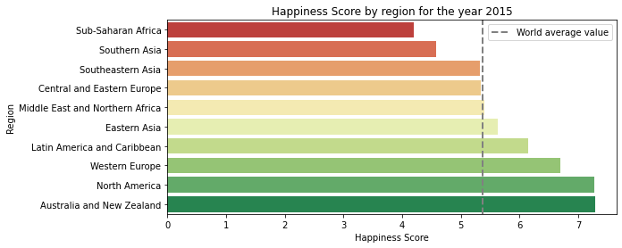
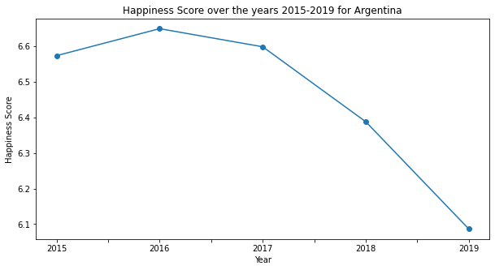

# :rainbow:  Happiness around the world

## About

This project analyzes happiness and well-being for the whole world in 2015 and for Argentina during the period 2015-2019, using the [World Happiness Report](https://www.kaggle.com/unsdsn/world-happiness) dataset available on [Kaggle](https://www.kaggle.com/). 

The project contains a Jupyter Notebook.

## Technologies used

- Jupyter Notebook 
- Python 3
  - Libraries: Matplotlib, Pandas, Seaborn, Plotly.  

## How to use

Run on terminal the following command:

    $jupyter notebook happiness_around_world.ipynb

## Some results

### Happiness by region for the year 2015

By 2015, the happiest countries were in Europe, North America and Oceania.

### Influence of different factors on the happiness of Argentines in 2015 

Economy and Family were the variables that most impacted on the well-being of the Argentines in 2015.

### Evolution of the Happiness Score in Argentina 
 
The Happiness Score in Argentina for the period 2015-2019 has a clear decreasing trend.

----
### Author
Débora Magalí Quindimil

